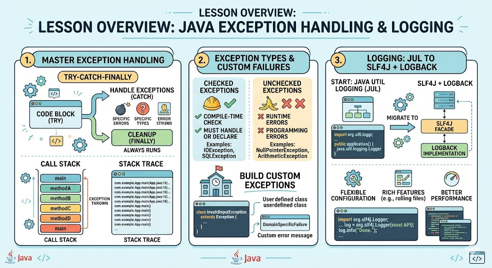

# [3.9] Exception Handling and Logging in Java

## Lesson Overview

## Dependencies
- [Self Studies](./studies.md)
- [Lesson](./lesson.md)
- [Assignment](./assignment.md)
- [Slide Deck](./slides.md)

## Lesson Objectives
* **Implement** exception handling using `try-catch-finally` and explain the call stack and stack trace
* **Distinguish** checked vs unchecked exceptions and build custom exceptions for domain-specific failures
* **Apply** logging to a Java program using JUL, then migrate to SLF4J + Logback

## Lesson Plan

| Duration | What | How or Why |
|----------|------|------------|
| 60 min | Doubt clarification / Revision | Open Q&A — students clarify doubts from previous lessons; instructor revisits difficult topics |
| 10 min | Warm up | Intro to exceptions — what goes wrong in programs and why we need error handling |
| 30 min | Part 1: Exceptions / Try-Catch-Finally | Call stack, stack trace, LBYL vs EAFP, checked vs unchecked, try-with-resources, propagation |
| 10 min | Part 2: Custom Exceptions | Extend RuntimeException / Exception; InvalidArrayIndex and NegativeNumber examples |
| 10 min | Activity 1 — Custom Exceptions | sumPositiveArray (unchecked) + divideByElementAtIndex (checked) |
| 10 min | Part 3: JUL Logging | Logger setup, SEVERE / WARNING / INFO levels, code-along with LoggerDemo |
| 5 min | Activity 2 — Add JUL Logging | Add INFO and SEVERE logs to LearnExceptions.java |
| 20 min | Part 4: Maven Project Setup | Create Maven project, set Java 21 in pom.xml |
| 15 min | Parts 5 & 6: SLF4J + Logback | Add dependencies, configure logback.xml, console + file appenders |
| 5 min | Activity 3 — SLF4J + Logback | Trigger ArithmeticException, verify console and file output |
| 15 min | Wrap up | Recap exception model, custom exceptions, JUL → SLF4J+Logback; preview assignment; Q&A |
| **Total** | | **190 min (60 min revision + 130 min teaching)** |