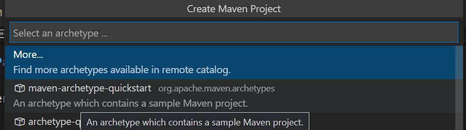
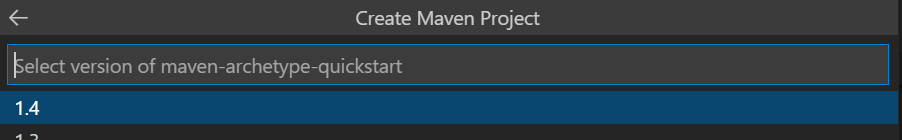
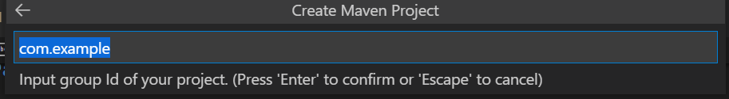
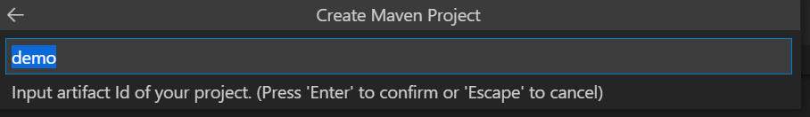
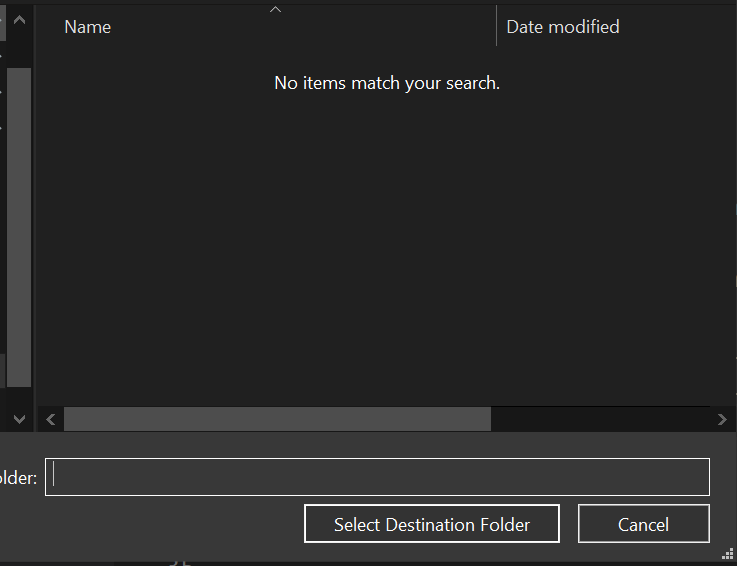
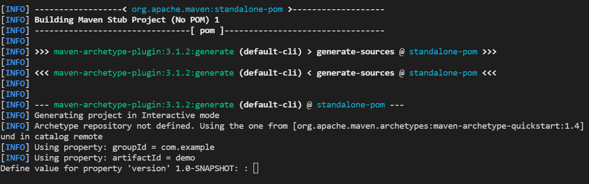
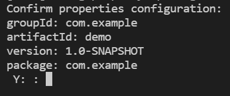
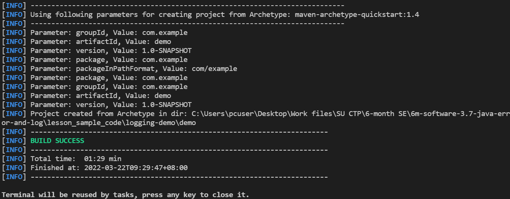
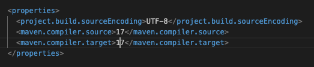

## Lesson Overview

This lesson introduces **exception handling** and **logging** in Java (Java 21 ready). You’ll learn how Java throws and handles exceptions, when to use LBYL vs EAFP, how to design specific vs general handlers, and how to propagate with `throws`. You’ll also configure logging with **JUL**, adopt the **SLF4J** façade, and use **Logback** (console/file appenders) so behavior can change without touching application code.

## Lesson Objectives

By the end of this lesson, learners will be able to:
- Explain the exception model (call stack, stack trace) and handle errors with `try–catch–finally`.
- Distinguish between **checked** and **unchecked** exceptions and choose appropriate handling or propagation with `throws`.
- Create and use **custom exceptions** to express domain-specific failures.
- Compare **LBYL** vs **EAFP** and justify when to use each.
- Implement logging with **JUL**, then migrate to **SLF4J + Logback**.
- Configure **Logback** levels/patterns and write to **console** and **file** in a Maven (Java 21) project.

## Part 1: Exceptions / Try-Catch-Finally

### What is an Exception?

An exception is an event, which occurs during the execution of a program, that disrupts the normal flow of the program's instructions.

https://docs.oracle.com/javase/tutorial/essential/exceptions/definition.html

When an error occurs within a method, the method creates an object and hands it off to the runtime system. The object, called an **exception object**, contains information about the error, including its type and the state of the program when the error occurred. Creating an exception object and handing it to the runtime system is called **throwing an exception**.


Source: https://www3.ntu.edu.sg/home/ehchua/programming/java/j5a_exceptionassert.html

The runtime system searches the **call stack** for a method that contains a block of code that can handle the exception. This block of code is called an **exception handler**.

If no appropriate exception handler is found, then the program terminates.

**Advantages of Exceptions**

1. **Separating Error-Handling Code from "Regular" Code**  
   The ability to throw exceptions makes it easy to separate error-handling code from regular code.

2. **Propagating Errors Up the Call Stack**  
   The ability to propagate errors up the call stack means you can write methods for the normal case and let callers handle boundary or unexpected situations.

3. **Grouping and Differentiating Error Types**  
   Each exception type indicates a particular error condition. You can create your own exceptions to signal domain-specific failures.

### Looking at Our First Exception

Create a file `LearnExceptions.java` and code along.

Add a method `divide`.

```java
public static int divide(int x, int y) {
  return x / y;
}
```

And call it in the `main` method.

```java
public static void main(String[] args) {
  int x = 10;
  int y = 0;
  int result = divide(x, y);
  System.out.println(result);
}
```

Run the code and see what happens.

As you might expect, the code throws an exception because you cannot divide by zero.

Java prints something known as a **stack trace**. The stack trace shows what is known as the **call stack** (the list of methods that were called). It shows the order in which methods are called and where the error occurred.

In our example here, the call stack is: `main` → `divide`.

```java
Exception in thread "main" java.lang.ArithmeticException: / by zero
        at LearnExceptions.divide(LearnExceptions.java:15)
        at LearnExceptions.main(LearnExceptions.java:5)
```

### LBYL and EAFP Approaches

There are 2 main approaches to dealing with errors when programming.

1. **Look Before You Leap (LBYL)**
2. **Easier to Ask for Forgiveness than Permission (EAFP)**

LBYL means that you check for errors before you execute the code.

EAFP means that you let the code run, throw an exception if there is an error, and then handle the exception.

LBYL vs EAFP: https://programmingduck.com/articles/lbyl-eafp

Using the LBYL approach in our `main`, we can first check if the divisor is zero before we allow the `divide` method to be called.

```java
public static void main(String[] args) {
  int x = 10;
  int y = 0;

  if (y == 0) {
    System.out.println("Cannot divide by zero");
  } else {
    int result = divide(x, y);
    System.out.println(result);
  }
}
```

As you can see, with LBYL, the developer proactively checks preconditions before executing the code, which avoids the exception. Disadvantages include time-of-check/time-of-use gaps and duplicated checks.

### Try-Catch-Finally (+ Multi-Catch)

The other approach is EAFP using a `try-catch` block.

```java
try {
  int result = divide(x, y);
  System.out.println(result);
} catch (ArithmeticException exception) {
  System.out.println(exception);
}
```

You can also add a `finally` block to execute code that should always run:

```java
try {
  int result = divide(x, y);
  System.out.println(result);
} catch (ArithmeticException exception) {
  System.out.println(exception);
} finally {
  System.out.println("This is the finally block");
}
```

**Multi-catch** (useful for related handling):

```java
try {
  // code that may throw different exceptions
} catch (IllegalArgumentException | IllegalStateException e) {
  System.out.println("Bad input/state: " + e.getMessage());
}
```

Let's look at an array example.

```java
int[] numbers = { 1, 2, 3, 4, 5 };
int index = 5;
System.out.println(numbers[index]); // throws ArrayIndexOutOfBoundsException
```

LBYL:

```java
if (index >= 0 && index < numbers.length) {
  System.out.println(numbers[index]);
} else {
  System.out.println("Index is out of bounds");
}
```

EAFP:

```java
try {
  System.out.println(numbers[index]);
} catch (ArrayIndexOutOfBoundsException exception) {
  System.out.println(exception);
}
```

Here is another example with a `Scanner`.

```java
import java.util.Scanner;

Scanner scanner = new Scanner(System.in);
System.out.print("Enter a number: ");
int number = scanner.nextInt(); // may throw InputMismatchException
System.out.println("You have entered: " + number);

// Note: Do NOT close scanner wrapping System.in in small programs,
// as closing it closes System.in for the entire JVM session.
```

A failing stack trace points us to where the exception occurred in our code:

```java
Exception in thread "main" java.util.InputMismatchException
        at java.base/java.util.Scanner.throwFor(Scanner.java:939)
        ...
        at LearnExceptions.main(LearnExceptions.java:36)
```

LBYL with `Scanner`:

```java
if (scanner.hasNextInt()) {
  int n = scanner.nextInt();
  System.out.println(n);
} else {
  System.out.println("Input is not an integer");
}
```

EAFP:

```java
try {
  int n = scanner.nextInt();
  System.out.println(n);
} catch (InputMismatchException exception) {
  System.out.println(exception);
}
```

### Checked vs Unchecked Exceptions

#### Unchecked Exceptions

`ArithmeticException`, `ArrayIndexOutOfBoundsException`, and `InputMismatchException` are **unchecked exceptions** (subclasses of `RuntimeException`). They are not checked at compile time and typically signal programming errors. Anticipate and prevent them via validation.

#### Checked Exceptions

**Checked exceptions** are verified at compile time (e.g., `IOException`, `FileNotFoundException`). The compiler requires handling or propagation.

**Try-with-resources (Java 7+, recommended in Java 21):**

```java
import java.io.FileInputStream;
import java.io.FileNotFoundException;
import java.util.Scanner;

try (FileInputStream f = new FileInputStream("test.txt");
     Scanner s = new Scanner(f)) {
  if (s.hasNextLine()) {
    System.out.println(s.nextLine());
  }
} catch (FileNotFoundException exception) {
  System.out.println(exception.getMessage());
}
```

### Propagating Exceptions Up the Call Stack

We can also propagate exceptions up the call stack. Put the previous file-reading code into a method and **do not** handle it there—let callers decide.

```java
import java.io.FileInputStream;
import java.io.FileNotFoundException;
import java.util.Scanner;

public static void readFileFirstLine(String filename) throws FileNotFoundException {
  try (FileInputStream f = new FileInputStream(filename);
       Scanner s = new Scanner(f)) {
    if (s.hasNextLine()) {
      System.out.println(s.nextLine());
    } else {
      System.out.println("File is empty");
    }
  }
}
```

And in `main`:

```java
public static void main(String[] args) {
  try {
    readFileFirstLine("test.txt");
  } catch (FileNotFoundException exception) {
    System.out.println(exception.getMessage());
  }
}
```

### General vs Specific Exception Type

General exception types are `Exception` or `RuntimeException` (superclasses of most exceptions). Specific exception types are subclasses (e.g., `FileNotFoundException` ⟶ `IOException` ⟶ `Exception`).

Prefer **specific** catches where possible:

```java
try {
  int result = 10 / 0;
  System.out.println(result);
} catch (ArithmeticException exception) {
  System.out.println(exception);
}
```

---

## Part 2: Custom Exception

We can also create our own custom exceptions. To create a **checked** exception, extend `Exception`. To create an **unchecked** exception, extend `RuntimeException`.

Unchecked example:

```java
public class InvalidArrayIndexException extends RuntimeException {
  public InvalidArrayIndexException(String message) {
    super(message);
  }
}
```

Usage:

```java
try {
  if (index < 0 || index > numbers.length - 1) {
    throw new InvalidArrayIndexException(index + " is not a valid index!");
  }
  System.out.println(numbers[index]);
} catch (InvalidArrayIndexException exception) {
  System.out.println(exception);
}
```

Another unchecked example:

```java
public class NegativeNumberException extends RuntimeException {
  public NegativeNumberException(String message) {
    super(message);
  }
}
```

```java
public static int dividePositiveNumbers(int a, int b) {
  if (a < 0 || b < 0) {
    throw new NegativeNumberException("Negative numbers are not allowed.");
  }
  return a / b;
}
```

```java
try {
  int result = dividePositiveNumbers(10, -2);
  System.out.println(result);
} catch (NegativeNumberException exception) {
  System.out.println(exception);
}
```

### 👨‍💻 Activity

#### Task 1: Unchecked Custom Exception

Create an unchecked exception `NoNegativeElementException`. Next, create a `sumPositiveArray` method that takes in an array of integers and throws `NoNegativeElementException` if the array contains a negative number, and returns the total sum of the array if all elements are positive.

```java
public static int sumPositiveArray(int[] numbers) {
  // your code here
}
```

#### Task 2: Checked Custom Exception

Create a checked exception `DivideByZeroElementException`. Next, create a `divideByElementAtIndex` method that takes an array of integers and an index. Throw `DivideByZeroElementException` if the divisor is zero, and return the division result otherwise.

```java
public static int divideByElementAtIndex(int[] numbers, int index) {
  // your code here
}
```

---

## Part 3: Java Logging

Create a `LoggerDemo.java` and code along.

Logging records information about the program's execution and is useful for debugging and monitoring.

### Java Logging API (JUL)

Java provides a logging API called `java.util.logging` (JUL).

```java
import java.util.logging.Level;
import java.util.logging.Logger;

public class LoggerDemo {
  private static final Logger logger = Logger.getLogger(LoggerDemo.class.getName());

  public static void main(String[] args) {
    logger.info("App started");
    int[] arr1 = { 1, 2, 3, 4 };

    try {
      System.out.println(arr1[4]); // will throw
    } catch (ArrayIndexOutOfBoundsException e) {
      logger.log(Level.SEVERE, "Out of bounds: " + e.getMessage());
      System.out.println(e);
    } finally {
      logger.warning("Be careful!");
      logger.info("App ended");
    }
  }
}
```

**Logging Levels**

| Level     | Description                                                                                                              |
| --------- | ------------------------------------------------------------------------------------------------------------------------ |
| `SEVERE`  | Serious errors or failures that may prevent the app from functioning properly or require immediate attention.            |
| `WARNING` | Potential problems that might lead to errors or unexpected behavior.                                                     |
| `INFO`    | Informational messages about normal application behavior.                                                                |
| `CONFIG`  | Configuration-related information (e.g., initialization).                                                                |
| `FINE`    | Debugging-oriented information.                                                                                          |
| `FINER`   | More detailed debugging information.                                                                                     |
| `FINEST`  | The most detailed debugging information.                                                                                 |

For JUL, by default, the logging level is `INFO`. Additional configuration is needed to see `FINE`/`FINER`/`FINEST`.

**Logging to a File (JUL)**

```java
import java.util.logging.*;

try {
  Handler fileHandler = new FileHandler("mylogfile.log", true);
  fileHandler.setFormatter(new SimpleFormatter());
  logger.addHandler(fileHandler);
} catch (java.io.IOException e) {
  System.out.println(e);
}
```

> Note: For production logs, avoid emojis and include actionable context (ids, inputs, state), but not sensitive data.

### 👨‍💻 Activity

Go back to your `LearnExceptions.java` file and add logging:

- Add `INFO` logs when the application starts and ends.
- Add `SEVERE` logs when an exception is caught.

---

## Part 4: Maven Project Creation


Maven is a build automation tool used primarily for Java projects. It is used to manage dependencies and automate the build process such as compiling source code, packaging the compiled code into a JAR file, as well as running automated tests.

Check if Maven is installed by running the following command in the terminal:

```bash
mvn -v
```

If not, install Maven using SDKMan.

```bash
sdk install maven
```

Check your VSCode extensions to see if Maven for Java is installed. This should already have been installed with the Java Extension Pack.

### Creating a Maven Project

We can create a Maven project using CLI (https://maven.apache.org/guides/getting-started/maven-in-five-minutes.html) or using VSCode.

In the Primary Side Bar, under the Maven or Java Projects tab, click on the plus sign to create a new Maven project.

Select the `maven-archetype-quickstart` archetype and click Next.



Select the version of Maven to use. Click Next.



Enter the group ID (`package` path), usually in reverse domain name notation e.g. sg.edu.ntu



Enter the artifact ID (project name).

 

Choose a folder to place the project in.

 

Hit 'enter' to use the default version value.

 

The project properties will be listed for confirmation. Type 'Y' to confirm.

 

The project is now created in the folder you chose.



Open the project in a new VSCode window.

Open the `pom.xml` file and set the **compiler release to 21** (screenshot may show 17



Update the `pom.xml`:

```xml
<properties>
  <maven.compiler.release>21</maven.compiler.release>
</properties>
```

## Part 5: Logging Using `slf4j`

With our Maven project, we’ll add dependencies for SLF4J (facade) and an implementation.

### What is `slf4j`?

SLF4J (Simple Logging Facade for Java) is a logging abstraction that lets you code to a stable API and swap implementations (e.g., Logback) without changing your application code.

### Adding Dependencies (SLF4J 2.x)

Search on https://mvnrepository.com/ and add:

```xml
<dependency>
  <groupId>org.slf4j</groupId>
  <artifactId>slf4j-api</artifactId>
  <version>2.0.12</version>
</dependency>

<!-- Simple implementation (good for demos/tests). Remove when switching to Logback. -->
<dependency>
  <groupId>org.slf4j</groupId>
  <artifactId>slf4j-simple</artifactId>
  <version>2.0.12</version>
  <scope>runtime</scope>
</dependency>
```

### Using `slf4j`

```java
import org.slf4j.Logger;
import org.slf4j.LoggerFactory;

public class App {

  private static final Logger logger = LoggerFactory.getLogger(App.class);

  public static void main(String[] args) {
    System.out.println("Hello World!");
    logger.info("Application started");
    logger.info("This is an informational message.");
    logger.error("This is an error message.");
    logger.warn("This is a warning message.");
    logger.info("Application ended");
  }
}
```

Run the application and check the console output.

---

## Part 6: Logging Using `logback`

The advantage of SLF4J is easy swapping of logging frameworks. Now switch to **Logback**.

### What is `logback`?

`logback` is a modern logging framework (successor to `log4j`) that’s fast and flexible.

### Adding Dependencies (Logback 1.5.x)

Remove `slf4j-simple` from `pom.xml` and add:

```xml
<dependency>
  <groupId>ch.qos.logback</groupId>
  <artifactId>logback-classic</artifactId>
  <version>1.5.6</version>
</dependency>
```

Just by changing dependencies, you’ve switched from `slf4j-simple` to `logback-classic`.

### Configure `logback`

Create `src/main/resources/logback.xml`:

```xml
<?xml version="1.0" encoding="UTF-8"?>
<configuration>
  <appender name="STDOUT" class="ch.qos.logback.core.ConsoleAppender">
    <encoder>
      <pattern>%d{HH:mm:ss.SSS} [%thread] %-5level %logger{36} - %msg%n</pattern>
    </encoder>
  </appender>

  <root level="DEBUG">
    <appender-ref ref="STDOUT" />
  </root>
</configuration>
```

Run the application and check the console output. Everything should work as before.

### Logging Levels in `logback`

| Level | Description                                                                  |
| ----- | ---------------------------------------------------------------------------- |
| TRACE | Finer-grained informational events than DEBUG.                               |
| DEBUG | Fine-grained informational events useful for debugging.                      |
| INFO  | Informational messages that highlight application progress.                  |
| WARN  | Potentially harmful situations.                                              |
| ERROR | Error events that might still allow the application to continue.             |

Add an error log:

```java
logger.error("This is an error message."); // Logback/SLF4J "ERROR" ≈ JUL "SEVERE"
```

### Logging to a File in `logback`

```xml
<?xml version="1.0" encoding="UTF-8"?>
<configuration>
  <!-- Console -->
  <appender name="CONSOLE" class="ch.qos.logback.core.ConsoleAppender">
    <encoder>
      <pattern>%d{HH:mm:ss.SSS} [%t] %-5level %logger{36} - %msg%n</pattern>
    </encoder>
  </appender>

  <!-- File -->
  <appender name="FILE" class="ch.qos.logback.core.FileAppender">
    <file>logs/application.log</file>
    <encoder>
      <pattern>%d{HH:mm:ss.SSS} [%thread] %-5level %logger{36} - %msg%n</pattern>
    </encoder>
  </appender>

  <root level="INFO">
    <appender-ref ref="CONSOLE"/>
    <appender-ref ref="FILE"/>
  </root>
</configuration>
```

Check `logs/application.log` after running.

For further reading, refer to the [logback documentation](http://logback.qos.ch/documentation.html).

### 👨‍💻 Activity

Port your code from `LearnExceptions.java` and add SLF4J+Logback logging. Trigger exceptions and verify console and file outputs.  
Note: there is no `SEVERE` in SLF4J/Logback; use `ERROR`.

---

END
