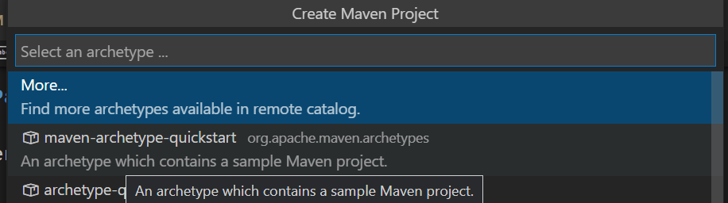
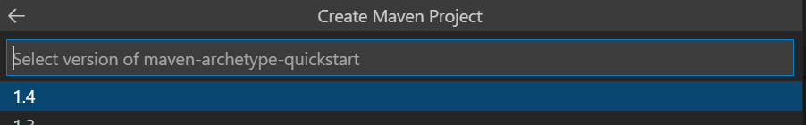
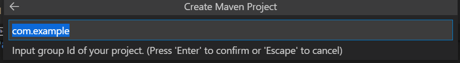
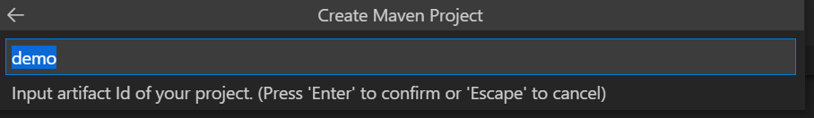
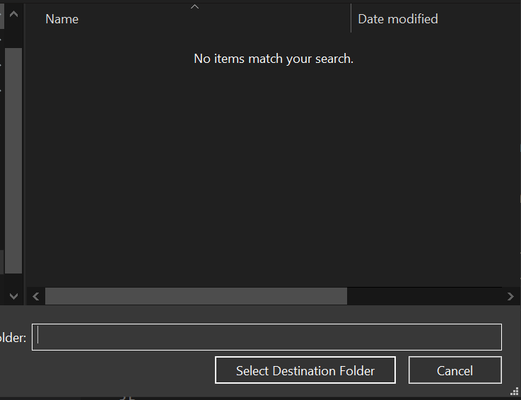
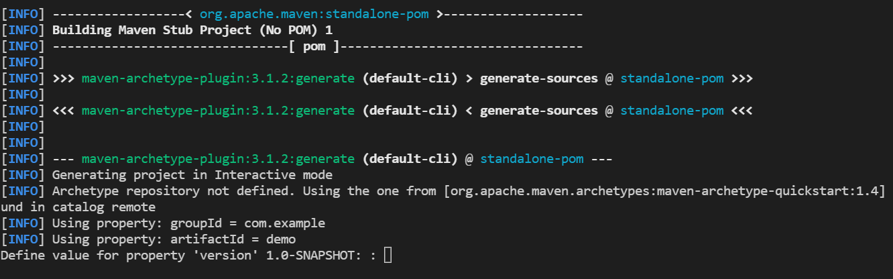
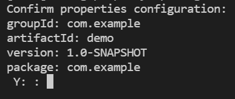
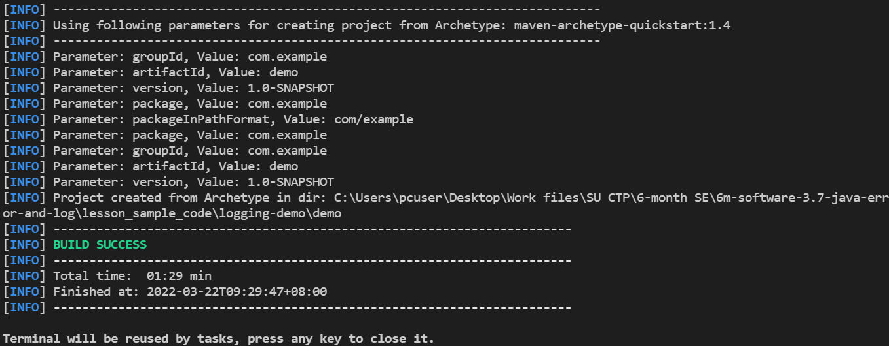
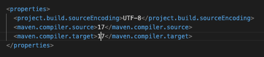

# 3.9 Self Studies

**Estimated Preparation Time:** 70 minutes

---

## Task 1 — Exception Handling in Java (30 minutes)

Watch the following video on Exception Handling in Java:

- 📹 [Exception Handling in Java — https://www.youtube.com/watch?v=1XAfapkBQjk&t=11s]
  

While watching, refer to **lesson.md Part 1 and Part 2** and pay attention to:
- What a stack trace is and how to read it
- The difference between `try`, `catch`, and `finally` and when each block runs
- The difference between checked exceptions (must handle or declare) and unchecked exceptions (runtime errors)
- How to create a custom exception by extending `RuntimeException` or `Exception`

**Guiding Questions:**
1. What is the difference between a checked and an unchecked exception? Give one example of each.
2. When does the `finally` block run? Can you think of a situation where it is useful?
3. Why would you create a custom exception instead of using a built-in one like `IllegalArgumentException`?

---

## Task 2 — Maven Project Setup (15 minutes)

### Maven Concepts — Read This First

Read this short section before watching the video so the setup steps make sense. (The in-class `lesson.md` Part 3 only covers *verifying* your setup — the concepts below are covered here in self-study.)

**What is Maven and why is it used?**
Maven is a **build automation and dependency management tool** for Java. It does two main jobs:
- **Manages dependencies** — instead of manually downloading library `.jar` files and adding them to your project, you declare the libraries you need and Maven automatically downloads them (and anything *they* depend on) for you.
- **Automates the build lifecycle** — it standardises compiling, testing, packaging, and running your project with simple commands, so every project builds the same predictable way.

**What is `pom.xml` and what does it contain?**
`pom.xml` (Project Object Model) is Maven's configuration file — the single place that describes your project. It contains:
- Project identity — `groupId`, `artifactId`, and `version`
- **Dependencies** — the external libraries your project uses
- Build settings — such as the Java compiler version (e.g. `maven.compiler.release`)
- Plugins and other build configuration

**How do you add a dependency?**
A dependency is an external library your project relies on. You add one by placing a `<dependency>` block inside the `<dependencies>` section of `pom.xml`, specifying three coordinates — `groupId`, `artifactId`, and `version`:

```xml
<dependency>
  <groupId>org.slf4j</groupId>
  <artifactId>slf4j-api</artifactId>
  <version>2.0.12</version>
</dependency>
```

When you save, Maven downloads that library automatically. You can find these coordinates for any library on https://mvnrepository.com/. (You will do exactly this in class when adding SLF4J and Logback.)

### Video

Watch the following video on Maven project setup:

- 📹 [Maven Project Setup in Java — [VIDEO URL NEEDED](https://www.youtube.com/watch?v=rqGRW-ocYpY)]
  

While watching, keep the concepts above in mind and pay attention to:
- What Maven is and why it is used
- What a `pom.xml` file is and what it contains
- How to add a dependency to a Maven project

**Guiding Questions:**
1. What is the purpose of the `pom.xml` file?
2. What is a dependency in Maven and how do you add one?
3. Why is it useful to use a build tool like Maven instead of managing libraries manually?

### ⚠️ Pre-Class Setup — Do This Before Attending Lesson 3.9

**You must have Maven installed and a Maven project created before class.** Follow the steps below completely.

#### Step 1: Verify or Install Maven

Check if Maven is installed by running the following command in the terminal:

```bash
mvn -v
```

If not installed, install Maven using SDKMan:

```bash
sdk install maven
```

Check your VSCode extensions to see if Maven for Java is installed. This should already have been installed with the Java Extension Pack.

#### Step 2: Create Your Maven Project


We can create a Maven project using CLI (https://maven.apache.org/guides/getting-started/maven-in-five-minutes.html) or using VSCode.

In the Primary Side Bar, under the Maven or Java Projects tab, click on the plus sign to create a new Maven project.

Select the `maven-archetype-quickstart` archetype and click Next.



Select the version of Maven to use. Click Next.



Enter the group ID (`package` path), usually in reverse domain name notation e.g. sg.edu.ntu



Enter the artifact ID (project name).



Choose a folder to place the project in.



Hit 'enter' to use the default version value.



The project properties will be listed for confirmation. Type 'Y' to confirm.



The project is now created in the folder you chose.



Open the project in a new VSCode window.

Open the `pom.xml` file and set the **compiler release to 21**.



The generated `pom.xml` will contain these two old compiler tags inside `<properties>` — **delete them both**:

```xml
<maven.compiler.source>1.7</maven.compiler.source>
<maven.compiler.target>1.7</maven.compiler.target>
```

Then replace with the new `release` tag so your `<properties>` block looks like this:

```xml
<properties>
  <project.build.sourceEncoding>UTF-8</project.build.sourceEncoding>
  <maven.compiler.release>21</maven.compiler.release>
</properties>
```

> **Important:** Do not keep both the old `source`/`target` tags and the new `release` tag — having both causes a conflict. Remove the old ones first.

> ✅ Once done, verify your project runs by opening `App.java` and running it. You should see `Hello World!` in the terminal. You are now ready for class.

---

## Task 3 — SLF4J + Logback (25 minutes)

Watch the following video on SLF4J and Logback:

- 📹 [SLF4J + Logback Logging in Java — https://www.youtube.com/watch?v=oiaEP57nsmI&t=922s]
  

While watching, refer to **lesson.md Parts 4 and 5** and pay attention to:
- What SLF4J is and why it is used as a facade rather than a direct logging framework
- How to add SLF4J and Logback dependencies to `pom.xml`
- How to configure `logback.xml` for console and file output
- The difference between logging levels: TRACE, DEBUG, INFO, WARN, ERROR

**Guiding Questions:**
1. What is the difference between SLF4J and Logback — what does each one do?
2. What does the `logback.xml` configuration file control?
3. If you wanted to stop DEBUG logs from appearing in production, what would you change in `logback.xml`?

---

## Active Engagement Strategies

- Pause and code along with each video in VS Code
- After each video, close it and try to recreate the example from memory
- Use the guiding questions to check your understanding before class

---

## Additional Reading Material

- [Java Exception Handling — W3Schools](https://www.w3schools.com/java/java_try_catch.asp)
- [Java Custom Exceptions — Baeldung](https://www.baeldung.com/java-new-custom-exception)
- [Maven in 5 Minutes — Apache Maven](https://maven.apache.org/guides/getting-started/maven-in-five-minutes.html)
- [SLF4J Documentation](https://www.slf4j.org/manual.html)
- [Logback Documentation](http://logback.qos.ch/documentation.html)